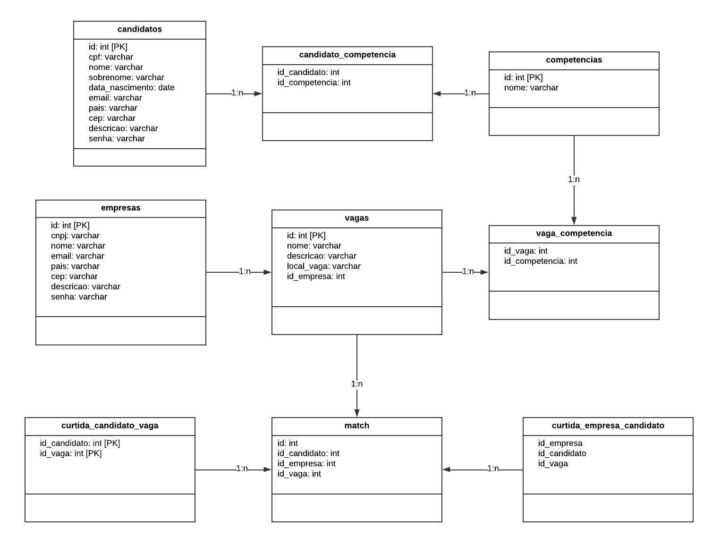

# Linketinder - Banco de Dados PostgreSQL

Banco de dados desenvolvido para a aplicação **Linketinder**, utilizando **PostgreSQL**, como parte do projeto introdutório da trilha **K1-T9: Banco de Dados (PostgreSQL)** do Acelera ZG.

O objetivo é criar a estrutura de dados necessária para representar candidatos, empresas, vagas, competências, curtidas e matches da aplicação.

---

## 📌 Tabelas definidas

O banco de dados foi desenvolvido para armazenar e relacionar as principais informações do Linketinder:

- Candidatos;
- Empresas;
- Vagas;
- Competências;
- Competências dos candidatos;
- Competências exigidas pelas vagas;
- Curtidas dos candidatos nas vagas;
- Curtidas das empresas nos candidatos;
- Matches entre candidatos, empresas e vagas.

A modelagem foi feita pensando nos relacionamentos existentes na aplicação e utilizando chaves primárias e estrangeiras para manter a integridade dos dados.





---

## 🛠️ Tecnologias utilizadas

- **PostgreSQL**
- **SQL**
- Modelagem de banco de dados

---

## 🗂️ Estrutura do Banco

O banco possui as seguintes tabelas:

```text
candidatos
empresas
vagas
competencias
candidato_competencia
vaga_competencia
curtida_candidato_vaga
curtida_empresa_candidato
match
```

Foram criadas tabelas para candidatos e empresas, além das tabelas de vagas e competências. Como um candidato pode possuir várias competências e uma vaga pode exigir várias competências, foram utilizadas tabelas intermediárias para representar esses relacionamentos N:N.

Também foram implementadas as relações de curtidas entre candidatos, vagas e empresas e a tabela de match, que registra quando existe interesse entre as partes.

Além da criação das tabelas, foram inseridos dados fictícios de candidatos, empresas, competências e vagas, permitindo testar os relacionamentos e consultas do banco.

De forma geral, o projeto busca representar a lógica principal do Linketinder no banco de dados, garantindo a organização das informações e a integridade dos relacionamentos por meio de chaves primárias, chaves estrangeiras, restrições UNIQUE e ON DELETE CASCADE.